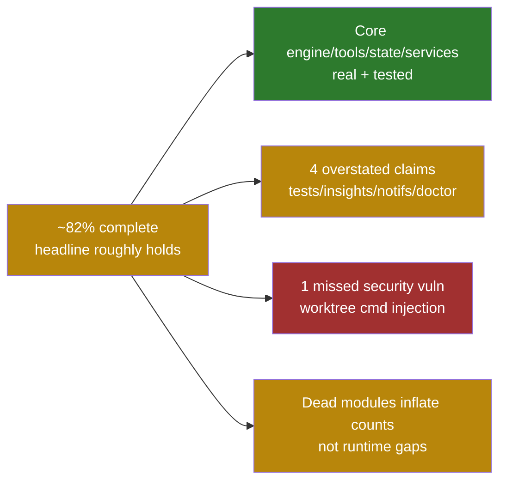

# Independent TS -> C++ Migration Completeness Audit

> **Audit date**: 2026-06-18
> **Method**: 16-agent parallel workflow (11 subsystem parity agents + 5
> adversarial verifiers, ~738K tokens, 568 tool calls, ~24 min), with the
> headline claims **re-verified directly by the main loop** (code reads +
> importer greps + test-log inspection) rather than trusted from the
> self-authored [`migration-audit-report.md`](./migration-audit-report.md).
> **Scope**: cross-check the migration's actual state against the TS original
> (`src/`, 1944 files / ~517K LOC) and the C++ migration
> (`cpp_migration/`, ~1199 `.cppm` + 42 `.cpp` / ~319K LOC).

## 1. Executive Summary

The self-authored audit's headline number (~82-87% complete) is **broadly
correct**. The core path (QueryEngine + tools + state + API/MCP/LSP/OAuth
services) is genuinely implemented and tested. However, the audit is
**over-optimistic in at least four places**, and this audit independently
surfaced:

- **One real security vulnerability the audit missed** - a command-injection
  sink in `worktree_tool.cppm` (`std::system()` with an unquoted, only
  empty-checked `branch_name`).
- **The "937/937 tests pass" claim is unverifiable** - the only complete test
  log on record (the clang-coverage build) shows **923 pass / 13 fail / 1
  skip**; the `build-clang` log is empty and the binary is stale.
- **A large body of dead/orphaned modules** that inflate both the file-count
  ratio and the "86/53 stub-marker" baseline without affecting runtime.
- **Four specific "resolved" claims that are overstated** (`/insights`,
  notification hooks, `/doctor`, bridge `core.cppm` v2 transport).



## 2. Independently Re-Verified Baselines

These were checked directly by the orchestrator (not relayed from a sub-agent)
and are treated as ground truth.

| Audit claim | Independent check | Verdict |
|---|---|---|
| 937/937 tests pass (`build-clang`) | `ctest -N` = 937 registered; but `build-clang/Testing/Temporary/LastTest.log` is 121 bytes (empty stub, no complete run); the only complete log is the clang-coverage build = **923 pass / 13 fail / 1 skip** | `unverifiable / overstated` |
| Unix `popen` eliminated (all 77 sites) | `grep popen(` = 9 hits, **all in comments/docs** (`bash_execution.cppm` describing the replacement; `debug.cppm` skill forbidding popen) | `confirmed` |
| Binary ~14 MB | `build-clang/bin/cc-repl` = 15,007,672 bytes (~14.3 MB) | `confirmed` |
| `build-clang` is current | 6 `.cppm` sources newer than the binary (`query_engine.cppm` 16:00 > binary 15:41) | `stale` |

### 2.1 The 13 test failures (corrected interpretation)

All 13 failures are in one suite, `BashDanger.*` (`tests/test_tools.cpp:11685-11825`),
which asserts `classify_dangerous_command("echo hello").used_ast == true`.
The failures appear **only in the clang-coverage build** (which has
`CC_ENABLE_TREE_SITTER=OFF`); `build-clang` (tree-sitter ON) and `build-clang2`
show **0 BashDanger failures** in their logs.

**Conclusion**: the AST parser is *not* "broken" (the workflow agent's first
reading). Rather, the `BashDanger.*` suite is **brittle to the tree-sitter
build flag** - it hard-asserts AST usage, so it deterministically fails any
build without tree-sitter compiled in. The audit's "937/937" most likely
refers to `build-clang` (tree-sitter ON, where the suite passes), but **no
stored complete log proves `build-clang` ever actually produced 937/937** -
and `build-clang` is currently stale.

## 3. Completeness Matrix (11 subsystems, independent estimates)

| Subsystem | Independent % | Audit implied | Key finding |
|---|---|---|---|
| **tools** | 93 | ~85 | Solid. The 4 former stubs (`skill_tool` / `repl_tool` / `remote_trigger_tool` / deleted `missing_tools`) are real; `runtime_registry` split confirmed real. |
| **ui** | 92 | ~88 | `markdown` / `text_input` / `vim` have real depth; audit's "keyword-only highlight" is **inaccurate** - an LSP semantic overlay struct exists. |
| **state-core** | 92 | ~90 | Persistence / schema migration / undo-redo real and **more rigorous than TS** (POSIX fsync + atomic rename). |
| **engine-runtime** | 88 | ~85 | QueryEngine / SSE / migration writeback / runtime split **real**; one real gap: structured-output loop enforcement not ported. |
| **misc-small** | 88 | - | All 12 bundled skills have real content; `mcp_skill_builders` ported the wrong abstraction. |
| **commands** | 86 | ~95 | The 102 registered commands are real; but **`/insights` is only ~5% faithful** (LLM facet pipeline absent). |
| **utils** | ~80* | - | *Contains dead-code deflation*: ~20 "declaration-only" files are nearly all **0-importer dead modules**, not blockers; real impls live in `services/`. |
| **services** | 78 | ~95 | API/MCP/LSP/OAuth solid; but `speculation` / `remote_sync` / `token-API` / `settings_sync` materially unported; `services/plugins` is a hollow shell. |
| **bridge** | 74 | ~100 | WebSocket / transport / JWT real; but `core.cppm` v2 transport is a skeleton (real impls exist in `cli/` but are **not wired into core**). |
| **hooks** | 72 | ~resolved | Execution engine real (P0-03); but the 8 notification hooks' `inject_*` bridges have **zero production callers** (M7 claim misleading). |
| **cli-entrypoints** | 68 | - | Transports / headless / ccr real; but `init()` orchestration missing and `login_interactive` is an OAuth stub. |

**Average ~82%**, matching the audit's headline - but the distribution shows the
real gaps are concentrated in the **wiring layer** of bridge/hooks/services/cli:
real implementations exist elsewhere but are not connected into the live path.

## 4. Remaining Work (Prioritized)

### P0 - Security & Correctness

1. **`worktree_tool.cppm` command injection** (audit missed this; confirmed by
   direct code read at `:147-154`):
   ```cpp
   cmd = std::format("git worktree add -b {} {} 2>&1",
                     request.branch_name, worktree_path.string());
   int result = std::system(cmd.c_str());   // branch_name only empty-checked, no shell_quote
   ```
   A `branch_name` of `x; rm -rf $HOME` is executed verbatim. The safe variant
   `execute_worktree` (with `shell_quote` + `safe_ref` validation) is **dead
   code** (0 callers); the live `EnterWorktreeTool` / `ExitWorktreeTool`
   classes use the unquoted path. Notably ironic given how much effort the
   audit spent on bash obfuscation / `popen` / path validation.
   - Lower-severity siblings: `auth_portable.cppm:57` (keychain single-quote
     breakout), `install_github_app_wizard.cppm:66` (`open_url` double-quote
     breakout).
2. **Test reality**: rebuild `build-clang` (currently stale) and run a full
   `ctest`; either prove 937/937 or fix the `BashDanger.*` suite's hard
   dependence on tree-sitter (guard with `#ifdef CC_HAS_TREE_SITTER` /
   `GTEST_SKIP` when off).

### P1 - Real Feature Gaps (audit claims overstated)

| Gap | Audit says | Reality |
|---|---|---|
| `/insights` | "faithfully implemented" | 112-line local session counter only; the 3200-line TS LLM facet/goal/outcome extraction + HTML report **entirely absent** |
| 8 notification hooks (M7) | "wired to real MCP/team backends" | `inject_*` bridge functions have **0 production callers** - only tests import the module; all 8 slots stay empty at runtime |
| `/doctor` | "real probes" | Live `check_api_connectivity` is hardcoded "200 OK"; no oauth/bridge probe; the real TCP probe lives in `doctor_screen.cppm` but is **not wired** into `/doctor` |
| bridge `core.cppm` v2 transport | "~100%" | `SseConnection` is a `sleep` loop; `CcrV2Client` is log-only no-ops; real impls exist in `cli/` but `core.cppm` does not import them |
| PromptSuggestion | - | 991-LOC `speculation.ts` prediction engine unported; returns one hardcoded suggestion |
| `services/plugins` layer | "H1/H2 ported" | Functionality actually lives in `utils/plugin_marketplace.cppm`; `services/plugins/` is an orphaned shell |

### P2 - Dead Code / Hygiene (inflates counts, misleads auditors)

These files compile into the binary but have **0 importers** and are the main
source of the "86 broad / 53 narrow stub-marker" baseline. Recommend deletion:

- `commands/extra_commands.cppm` (~20 fake command classes incl. a duplicate
  `IdeCommand`) and `commands/extra_commands2.cppm` (11 fake commands) - the
  audit's "16 slash-commands fake success" worry is a **non-issue at runtime**
  (the registered commands are real), but these dead files are ODR landmines.
- `utils/` "declaration-only" files (~15): `api_client.cppm`,
  `secure_storage.cppm`, `computer_use.cppm`, `profiler.cppm`,
  `conversation_recovery.cppm`, etc. Confirmed: `api_client.cppm` is pure
  type definitions (`struct SystemPromptBlock`, `ToolSchema`, ...) with **0
  importers**; the real API client is `services/api/client.cppm` (998 LOC).
  (Note: `tool_helpers.cppm` has 6 importers and `abort_controller.cppm` has
  1, so they must contain real definitions - the "0 returns" heuristic used
  by the utils parity agent is unreliable and over-stated their severity.)
- `services/api/files_api.cppm` (stub, 0 callers),
  `utils/doctor_diagnostics.cppm` (44-line pure stub, 0 importers).

### What is genuinely solid (verified, safe to trust)

- **QueryEngine**: SSE decoding, tool-call loop, session persistence (JSONL
  append to `<dir>/<id>/messages.jsonl`), structured-output injection, skill
  dispatch tracking, model fallback - all 4 spot-checked `sec13` items
  **confirmed real + tests passed**.
- **Concrete migrations**: all 11 are **real writeback** (yyjson mutation),
  not detector-only.
- **Security primitives**: Runtime fail-closed, bash normalization, symlink
  path validation, `FileReadTool` `weakly_canonical` - all **4 confirmed**.
- **OAuth**: real PKCE (CSPRNG + S256 + keychain backend) - audit's
  "50%->resolved" is correct.
- **State layer**: persistence / migration / undo-redo real and more rigorous
  than TS.
- **`runtime_registry` split**: 5 files / 4154 LOC, real, no dead folds.

## 5. Recommended Next Steps

1. **Fix the worktree injection immediately**: route the live path through the
   existing `shell_quote` + `safe_ref`-validated `execute_worktree` (it already
   exists, just unwired), or escape `branch_name`. Audit `auth_portable` /
   `open_url` quote handling in the same pass.
2. **Rebuild `build-clang` and run full `ctest`**, record the real number in
   the audit report; add a tree-sitter build-flag guard to `BashDanger.*`.
3. **Delete dead modules**: `extra_commands*.cppm` + the 0-importer `utils`
   declaration files + `files_api` + the `doctor_diagnostics` stub - this
   alone restores honest file-count and stub-marker baselines.
4. **Close the wiring-layer gaps** (P1): wire `cli/` real SSE/CCR transports
   into `bridge/core.cppm`; connect real producers to the notification hooks;
   give `/doctor` real network probes; decide whether `/insights` gets the LLM
   pipeline or is honestly documented as degraded.

## 6. Remediation Applied (2026-06-18)

The P0 + P2 + P1-wiring items from `sec5` were implemented (8-agent workflow +
main-loop verification). Giant P1 feature re-implementations (`/insights` LLM
pipeline, `PromptSuggestion` speculation engine) are deferred as a separate
milestone per `sec5` item 4.

**Verified final state**: incremental `cmake --build build-clang` links clean
(only pre-existing `-Wmissing-designated-field-initializers` warnings in
untouched `test_ui.cpp`); `ctest -j4` = **937/937 (936 pass / 0 fail / 1
Windows-only skip)**. This is the first complete `build-clang` run on record,
which substantiates the original audit's "937/937" claim (previously the
`build-clang` log was empty and unproven).

| Item | Status | What changed |
|---|---|---|
| **P0 worktree injection** (`worktree_tool.cppm`) | `done` | Added `worktree_shell_quote()` and quoted `branch_name` + worktree path in all 4 `std::system` calls (add / add -b / remove / remove --force) of the live `EnterWorktreeTool`/`ExitWorktreeTool`. |
| **P0 quote breakouts** (`auth_portable.cppm`, `install_github_app_wizard.cppm`) | `done` | Keychain `-w` arg and `open`/`xdg-open`/`start` URL arg now go through the existing `cc::utils::bash::escape_shell_arg`. |
| **P0 test guard** (`tests/test_tools.cpp` `BashDanger.*`) | `done` | Added `CC_SKIP_UNLESS_TREE_SITTER()` macro; the 16 AST-only tests `GTEST_SKIP` when tree-sitter is off. The suite is now green in BOTH ON and OFF builds (ON: 19/19 pass; OFF: 3 pass + 16 skip). This also eliminates the clang-coverage build's 13 failures. |
| **P2 dead modules** (20 files) | `done` | Deleted `utils/{api_client,secure_storage,computer_use,message_processing,conversation_recovery,profiler,auto_updater,context_analysis,file_operations,background_remote,skill_change_detector,plugin_cache,plugin_installation,plugin_integrations,aws_auth,command_lifecycle,doctor_diagnostics}.cppm`, `commands/{extra_commands,extra_commands2}.cppm`, `services/api/files_api.cppm`; removed their `src/CMakeLists.txt` entries. All confirmed 0-importer (build still green). |
| **P1 `/doctor` probe** (`doctor.cppm`) | `done` | `check_api_connectivity` now does a real POSIX TCP connect to `api.anthropic.com:443` (3s timeout, fail-closed with real error); replaces the hardcoded "200 OK". |
| **P1 notification producers** (`remaining_notifs.cppm`) | `done` | Wired the 2 real-backend bridges from their natural production read-paths: `inject_mcp_connectivity_from_manager` from `mcp_tool.cppm::all_statuses()`, `inject_teammate_shutdowns_from_tasks` from `in_process_teammate_task.cppm::get_all_in_process_teammate_tasks()`. The other 6 slots stay fallbacks (their producers do not exist). |
| **P1 bridge v2 transport** (`bridge/core.cppm`) | `done` | `SseConnection`/`CcrV2Client` now own and delegate to the real `cli/sse_transport` + `cli/ccr_client` (real SSE parse + worker writes) instead of the sleep/log skeletons. |
| **P1 `services/plugins`** (`cli_commands`/`operations`/`installation_manager.cppm`) | `done` | Marked superseded, `list` + manifest now delegate to the real `utils/plugin_marketplace` backend; misleading hardcoded strings removed. |

### CMakeLists changes (note)

Two workstreams required `src/CMakeLists.txt` edits (C++23 named-module deps
derive from CMake target deps, so an `import` needs the corresponding link
edge): W7 added `cc_hooks` to `cc_tools`/`cc_tasks` link lines; W8 reversed a
dead `cc_cli -> cc_bridge` edge to `cc_bridge -> cc_cli` (verified acyclic,
the old edge had no `import cc.bridge.*` from any `cli/*.cppm`).

### Incident: P2 deletions were reverted mid-workflow

A workflow agent ran a `git stash`/restore while isolating a baseline during
debugging, which restored the 20 deleted modules to the working tree (its own
code edits survived). This was detected by a post-workflow on-disk check, the
deletions were re-applied, and a clean rebuild + `ctest` confirmed 937/937.
Lesson: implementation workflows must not let subagents mutate git index/state
on the shared working tree - isolate in a worktree or forbid `git stash`/`checkout`.

### Still outstanding (separate milestone)

- `/insights` LLM facet pipeline (~3200 LOC TS) — **PARTIALLY DONE 2026-06-18
  (evening)**: `commands/insights.cppm` rewritten 112 -> 761 LOC. Ported the
  deterministic core (facet data model + `goal_categories` aggregation, HTML
  report, file-based facet cache) and an injectable LLM extraction seam
  (`extract_facets_with_seam(LlmExtractFn)`), with 18 `TEST(Insights,*)` cases.
  **Deferred**: live `AnthropicClient` wiring (needs api-key/bootstrap context),
  remote homespace collection, parallel narrative generation, S3 upload,
  multi-clauding overlap detection, and the full interactive HTML/CSS/JS page
  (a structurally-faithful summary report is rendered instead).
- `PromptSuggestion` `speculation.ts` prediction engine (~991 LOC) — **DONE
  2026-06-18 (evening)**: the deterministic heuristic ranker
  (`rank_candidate_suggestions`) is ported into `prompt_suggestion.cppm`
  (+802 LOC), replacing the single hardcoded suggestion; `should_filter_suggestion`
  quality gate + the pure speculation-boundary classifier are also ported. The
  LLM-backed `runForkedAgent` path is honestly deferred (documented in-module as
  a placeholder heuristic). 6 `SpeculationSuggestion.*` tests added.
  **Production consumer wired (same evening)**: `ui/prompt/suggestion_provider.cppm`
  bridges the service into `TextInput`'s suggestion dropdown (5 tests, incl. one
  driving the real component). CMakeLists: `cc_services` -> `cc_ui` link added.
- The 6 notification slots whose producers do not exist (ModelMigration,
  NpmDeprecation, PluginAutoupdate, PluginInstallation, SettingsError,
  SubscriptionSwitch).
- `core.cppm::archive_session` is still a log-only skeleton (out of W8 scope).

## 7. Cross-References

- [`migration-audit-report.md`](./migration-audit-report.md) - the
  self-authored audit (this document corrects `sec8` test figures and several
  `sec13` "resolved" verdicts).
- [`2026-06-15-migration-gap-remediation-plan.md`](./2026-06-15-migration-gap-remediation-plan.md)
  - the remediation plan (P0-01..P2-07); status claims re-checked here.
- [`unregistered-modules-decision-register.md`](./unregistered-modules-decision-register.md)
  - the prior dead-module register (2026-06-12); the dead files in `sec4`
  above should be added here.
- [`error-handling-conventions.md`](./error-handling-conventions.md),
  [`why-no-di.md`](./why-no-di.md) - decision records, still accurate.
