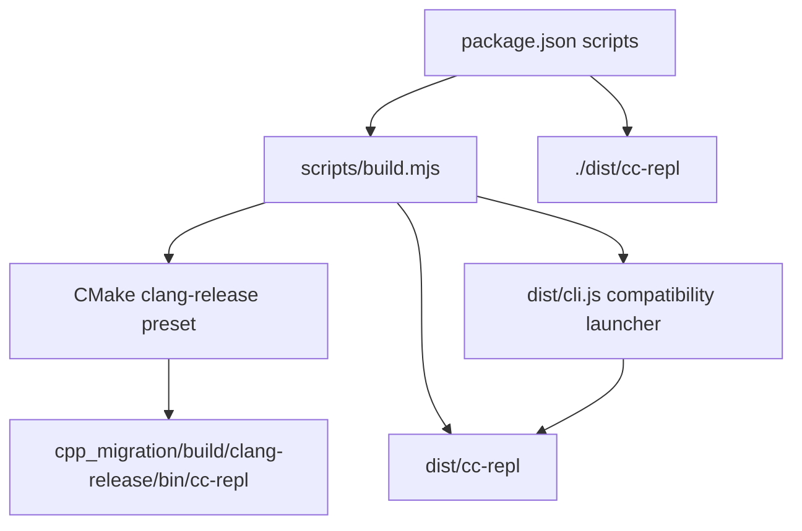

# CC-REPL C++ Architecture Review

> Updated: 2026-06-03
> Scope: Native C++ migration architecture, build entrypoints, command/tool coverage, and validation gates.

## Current Status

The native C++ migration is now the default product build path.

Validated gates:

- `bun run build` configures and builds `cpp_migration` with the `clang-release` CMake preset.
- `dist/cc-repl` is the default runtime entrypoint.
- `dist/cli.js` remains as a compatibility launcher that delegates to the native binary.
- `ctest --test-dir cpp_migration/build/clang-release --output-on-failure` passes.
- `node scripts/cpp-migration-inventory.mjs --strict` passes.
- `bun run migration:e2e` passes native version/help, package start, compatibility launcher, and strict inventory checks.

## Architecture Overview



## Native Module Layers

| Layer | CMake target | Responsibility |
| --- | --- | --- |
| Core types and utilities | `cc_types`, `cc_utils` | Shared types, parsing, filesystem, shell, JSON, security helpers |
| Runtime state | `cc_state`, `cc_context`, `cc_session` | App state, context, persistence, session history |
| Product features | `cc_tools`, `cc_commands`, `cc_services` | Tool execution, slash commands, API/MCP/LSP/OAuth integrations |
| Interaction | `cc_ui`, `cc_screens`, `cc_hooks` | Terminal UI, screens, notifications, hook orchestration |
| Integrations | `cc_bridge`, `cc_remote`, `cc_plugins`, `cc_skills` | IDE bridge, remote sessions, plugin loading, skill execution |
| Entrypoints | `cc_cli`, `cc_entrypoints`, `cc_repl` | CLI parsing, runtime dispatch, native executable |

## Migration Coverage

The strict inventory gate currently reports:

- Commands: `100/100`
- Tools: `45/45`
- CMake registered source/header entries: complete
- Unregistered C++ compilable files: `0`
- Registered but missing files: `0`
- Blocking migration markers: `0`

Non-blocking placeholder markers remain only where "placeholder" is a legitimate product concept, such as UI input placeholder text, template variable placeholders, and terminal image placeholders.

## Entry Point Policy

The default runtime is native:

```bash
bun run build
bun run start -- --version
```

`start:ts` is retained only as a migration diagnostic path for the TypeScript source tree. It is not the product default.

## Validation Commands

```bash
bun run build
cmake --build --preset clang-release
ctest --test-dir cpp_migration/build/clang-release --output-on-failure
node scripts/cpp-migration-inventory.mjs --strict
bun run migration:e2e
```

## Residual Risks

- Some native modules intentionally consolidate multiple TypeScript files, so file-count parity is not a meaningful completion metric.
- The compatibility launcher is still JavaScript, but it only delegates to the native binary.
- GoogleTest discovery can occasionally hit CMake's 5 second discovery timeout under heavy relinking; direct `--gtest_list_tests` and reruns complete normally.
