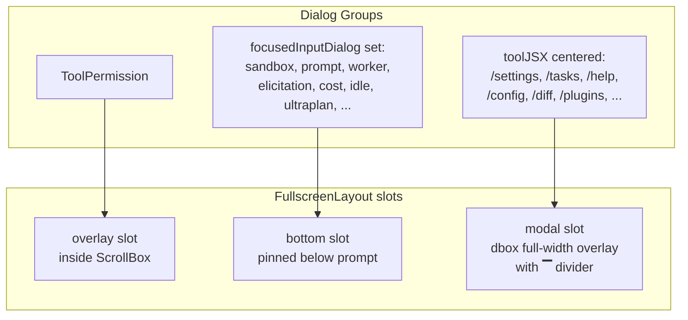
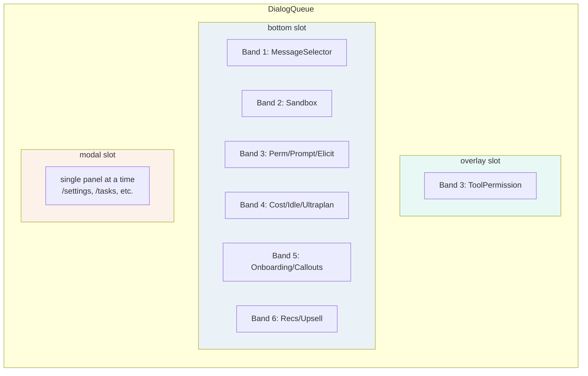
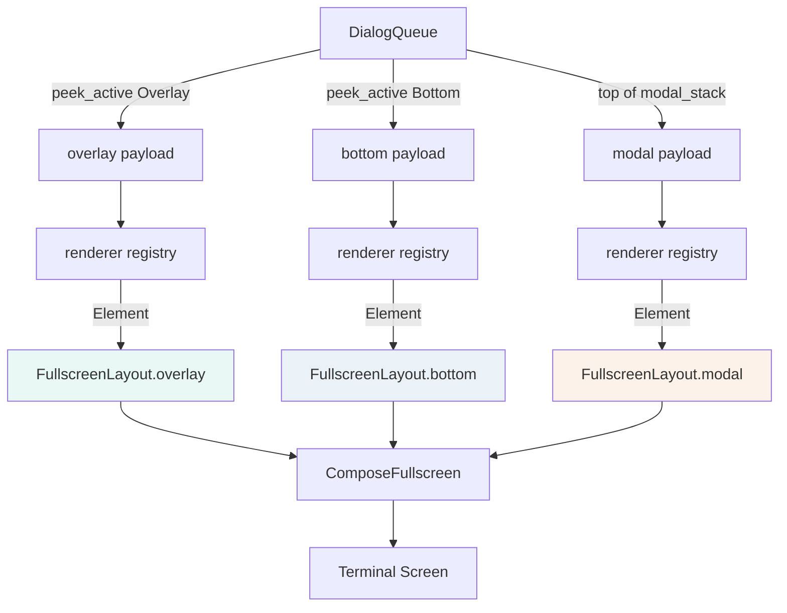

# M7 Dialog System Architecture Design

## 1. Overview

### 1.1 Problem Statement

The current C++ dialog system (`repl_screen.cppm` `dialog_stubs` namespace + 35 `.cppm` files in `src/ui/dialogs/`) is a divergent, partial reimplementation of the TS reference. It suffers from:

- **Monolithic enum pattern**: `ReplMode` + `DialogContext` struct = every dialog payload field lives in one flat struct. No type safety, no extensibility.
- **Stub quality**: 10 of 35 dialog files are 20-25 line stubs with placeholder UI.
- **No queue system**: TS has separate queues for each dialog type (`toolUseConfirmQueue`, `sandboxPermissionRequestQueue`, `promptQueue`, `elicitation.queue`, etc.) that naturally serialize multiple pending dialogs. C++ has a single `DialogContext` which loses multiple pending requests.
- **No priority system**: TS `getFocusedInputDialog()` implements a 7-band priority order. C++ relies on `ReplMode` being set externally with no arbitration.
- **No typing suppression**: TS hides interrupt dialogs while `isPromptInputActive`. C++ has the flag but no enforcement.
- **Mixed modal/standalone**: No clear separation between in-REPL modal dialogs (bottom-anchored, `modal` slot) and standalone full-screen dialogs (onboarding, trust — `showSetupDialog`).
- **No proper dialog frame**: TS `PermissionDialog` is a reusable frame (round top border, title, subtitle, worker badge, titleRight). C++ dialogs each reinvent their own window/border.

### 1.2 Goals (M7)

1. **Faithful visual port** of the 6 highest-priority dialogs to TS pixel-level fidelity.
2. **Proper dialog framework** — type-safe, extensible, queue-based, priority-arbitrated.
3. **Both dialog modes** work: modal (in-REPL overlay) and standalone (full-screen setup).
4. **Clean migration path** from existing `dialog_stubs` to the new framework.
5. **Verifiable** — each dialog has a golden snapshot test.

### 1.3 Non-Goals (M7)

- Porting all 35+ dialogs (M7 does top 6; remainder follow in M8+).
- Wizard dialogs (install GitHub/Slack, agent wizard) — these are large multi-step flows, deferred.
- Complex data-driven dialogs (Settings, Plugins, MCP full dialog) — deferred.
- Animation/transitions — FTXUI limitation; static faithful rendering only.

---

## 2. Two Dialog Modes

The TS reference has **two distinct dialog rendering paths**. M7 supports both.

### 2.0 Architecture Overview

```mermaid
graph TB
    subgraph EngineLayer[Engine Layer]
        QE[Query Engine]
        DLQ[Dialog Lifecycle Manager]
    end

    subgraph RenderLayer[Render Layer]
        FSL[FullscreenLayout]
        DLG[Dialog Renderer<br/>Registry]
        DF[DialogFrame<br/>reusable container]
        DQUEUE[DialogQueue<br/>priority bands + suppression]
    end

    subgraph DialogTypes[Dialog Types]
        MODAL[Modal Dialogs<br/>(in-REPL overlay)]
        STANDALONE[Standalone Dialogs<br/>(full-screen)]
        PANELS[Panels<br/>(inline, not dialogs)]
    end

    QE -->|push dialog request| DLQ
    DLQ -->|manages lifecycle| DQUEUE
    DQUEUE -->|peek_active| DLG
    DLG -->|renders content| DF
    DF -->|feeds modal slot| FSL

    DLG --> MODAL
    DLQ --> STANDALONE

    style MODAL fill:#e8f4fd,stroke:#3498db
    style STANDALONE fill:#fdf2e9,stroke:#e67e22
    style PANELS fill:#eafaf1,stroke:#27ae60
```

### 2.1 Modal / REPL-Integrated Dialogs

Rendered in **one of three slots** of `FullscreenLayout`. The TS reference is very precise about which dialog goes where.



| Slot | Position | Use Case | Examples |
|------|----------|----------|----------|
| **`overlay`** | Inside ScrollBox, bottom-aligned | Permission prompts — user can scroll up for context | ToolPermission |
| **`bottom`** | Pinned below prompt, flexShrink=0 | "Focused input" dialogs — they replace/float above the prompt | SandboxPermission, PromptDialog, WorkerSandboxPermission, Elicitation, CostThreshold, IdleReturn, UltraplanChoice/Launch, onboarding callouts, recs |
| **`modal`** | Bottom-anchored dbox overlay, full-width, `▔` divider, 2-row transcript peek | Full panels from JSX commands (/settings, /tasks, etc.) | SettingsPanel, TasksView, TeamsView, HelpView, QuickOpen, PluginDialog, MCPDialog, DiffDialog |

All three types are "modal" in the UX sense (capture keyboard focus). The C++ framework unifies all three under one `DialogType` enum but tracks the **slot preference** per dialog type.

These dialogs:
- Are queued (multiple can be pending, shown one at a time per slot)
- Have priority ordering within each slot
- Respect typing suppression (for `overlay` + `bottom` slots)
- Share keyboard navigation patterns
- Are non-blocking — the REPL keeps running underneath

### 2.2 Standalone Dialogs (Full-Screen)

Rendered as the sole UI (no REPL underneath). Driven by `showDialog<T>()` / `showSetupDialog<T>()` which returns a `std::future<T>` or blocks synchronously. These dialogs:

- Are full-screen (no transcript peek)
- Are modal-blocking (suspend REPL execution)
- Have their own keybinding scope
- Often have multi-step wizard patterns

**Examples**: onboarding, trust, settings, export, global search, quick open, history search, help, feedback survey, managed settings security.

---

## 3. Core Framework

### 3.1 DialogType Enum

A type tag enum, 1:1 with TS dialog types. Each type has an associated **slot preference**.

```cpp
enum class DialogType : std::uint16_t {
    // -- overlay slot (inside ScrollBox) --
    ToolPermission,         // 'tool-permission'

    // -- bottom slot (pinned below prompt) --
    MessageSelector,        // 'message-selector' (actually in scroll, but keyboard-focused)
    SandboxPermission,      // 'sandbox-permission'
    PromptDialog,           // 'prompt' (hook prompt)
    WorkerSandboxPermission,// 'worker-sandbox-permission'
    Elicitation,            // 'elicitation' (MCP)
    CostThreshold,          // 'cost'
    IdleReturn,             // 'idle-return'
    UltraplanChoice,        // 'ultraplan-choice'
    UltraplanLaunch,        // 'ultraplan-launch'
    IdeOnboarding,          // 'ide-onboarding'
    InitOnboarding,         // 'init-onboarding'
    ModelSwitch,            // 'model-switch'
    UndercoverCallout,      // 'undercover-callout'
    EffortCallout,          // 'effort-callout'
    RemoteCallout,          // 'remote-callout'
    LspRecommendation,      // 'lsp-recommendation'
    PluginHint,             // 'plugin-hint'
    DesktopUpsell,          // 'desktop-upsell'

    // -- modal slot (full-width dbox overlay, ▔ divider) --
    // These map to TS toolJSX.isLocalJSXCommand with toolJsxCentered=true
    SettingsPanel,          // /settings
    TasksView,              // /tasks
    TeamsView,              // /teams
    HelpView,               // /help
    QuickOpen,              // /quick-open
    PluginDialog,           // /plugins
    MCPDialog,              // /mcp
    DiffDialog,             // /diff
    ConfigDialog,           // /config
    ExportDialog,           // /export
    GlobalSearch,           // /search
    HistorySearch,          // history search
    BridgeDialog,           // /bridge
    WorktreeExitDialog,     // worktree exit
    RemoteEnvDialog,        // /remote
    FeedbackSurvey,         // feedback
    ManagedSettingsSecurity,// managed settings

    // -- Standalone / full-screen (not in REPL layout) --
    TrustDialog,
    Onboarding,

    // -- Wizards (multi-step standalone) --
    InstallGitHubAppWizard,
    InstallSlackAppWizard,
    CreateAgentWizard,
    EditAgentWizard,
};

/// Which FullscreenLayout slot a dialog renders in.
enum class DialogSlot : std::uint8_t {
    Overlay,    // inside ScrollBox (tool-permission)
    Bottom,     // bottom slot (focusedInputDialog set)
    Modal,      // modal slot (centered toolJSX)
    Standalone, // full-screen (showSetupDialog)
};

DialogSlot slot_for(DialogType type);
```

### 3.2 Priority Bands

Mirror TS `getFocusedInputDialog()` priority order (REPL.tsx:2017):

| Band | Dialogs | Suppressed by typing? |
|------|---------|----------------------|
| 0 (highest) | Exit states (implicit) | — |
| 1 | MessageSelector | No (always show) |
| 2 | SandboxPermission | Yes |
| 3 | ToolPermission, PromptDialog, WorkerSandboxPermission, Elicitation | Yes + blocked by toolJSX animation |
| 4 | CostThreshold, IdleReturn, UltraplanChoice, UltraplanLaunch | Yes |
| 5 | IdeOnboarding, InitOnboarding, ModelSwitch, UndercoverCallout, EffortCallout, RemoteCallout | Yes |
| 6 (lowest) | LspRecommendation, PluginHint, DesktopUpsell | Yes |

Priority is encoded as `DialogPriority = std::uint8_t`.

### 3.3 DialogPayload — Tagged Union

Replaces the flat `DialogContext` struct. Each dialog type gets its own payload struct.

```cpp
// src/ui/dialogs/dialog_payload.cppm (or .h)
struct DialogPayload {
    DialogType type;
    DialogPriority priority;
    std::string id;           // unique per-instance id (for keying)
    std::any data;            // type-erased payload (or use std::variant)
    // ... lifecycle callbacks
};
```

**Design choice**: Use `std::variant` for compile-time safety, not `std::any`.

```cpp
// Each dialog type defines its own payload struct
struct ToolPermissionPayload {
    std::string tool_use_id;
    PermissionRequestInfo request;
    std::optional<WorkerBadgeInfo> worker_badge;
    bool can_always_allow = true;
    // callbacks
    std::function<void(bool allow, bool always)> on_response;
    std::function<void()> on_reject;
};

// Variant of all payloads
using DialogPayloadVariant = std::variant<
    std::monostate,
    ToolPermissionPayload,
    SandboxPermissionPayload,
    PromptDialogPayload,
    ElicitationPayload,
    CostThresholdPayload,
    IdleReturnPayload
    // ... extended as more dialogs are ported
>;
```

### 3.4 DialogQueue

Per-slot, per-priority-band FIFO queue. The queue owns all pending dialog instances.



Each slot is independent — you can have a ToolPermission in `overlay` AND a cost dialog in `bottom` AND a settings panel in `modal` all at once (though TS avoids this in practice because toolJSX blocks permission dialogs).

```cpp
class DialogQueue {
public:
    // Push a dialog into the appropriate slot queue. Returns an id handle.
    std::string push(DialogPayloadVariant payload);

    // Remove a dialog by id (cancelled externally).
    void remove(std::string_view id);

    // Get the highest-priority, non-suppressed dialog for a given slot.
    std::optional<DialogPayloadVariant> peek_active(
        DialogSlot slot,
        bool is_prompt_input_active,
        bool allow_dialogs_with_animation) const;

    // Pop the current front of the highest-priority non-suppressed band.
    void pop_active(DialogSlot slot,
                    bool is_prompt_input_active,
                    bool allow_dialogs_with_animation);

    bool slot_empty(DialogSlot slot) const;
    size_t total_size() const;

private:
    // Overlay slot: single band (only ToolPermission)
    std::deque<DialogPayloadVariant> overlay_;

    // Bottom slot: 6 priority bands
    std::array<std::deque<DialogPayloadVariant>, 6> bottom_bands_;

    // Modal slot: single active panel (stack for navigation depth)
    std::vector<DialogPayloadVariant> modal_stack_;
};
```

### 3.5 DialogSuppression Logic

Mirror TS behavior:

```cpp
bool should_show_dialog(const DialogPayloadVariant& dlg,
                        bool is_prompt_input_active,
                        bool allow_dialogs_with_animation) {
    auto priority = get_priority(dlg);
    if (priority == DialogPriority::MessageSelector)
        return true;  // Band 1: never suppressed by typing

    if (is_prompt_input_active)
        return false; // All lower bands suppressed while typing

    // Band 3: blocked when toolJSX animation is running
    if (priority == DialogPriority::Permission && !allow_dialogs_with_animation)
        return false;

    return true;
}
```

---

## 4. Dialog Rendering

### 4.1 Dialog Renderer Interface

Each dialog type registers a renderer function.

```cpp
using DialogRenderer = std::function<Element(const DialogPayloadVariant&,
                                             const DialogRenderContext&)>;

class DialogRendererRegistry {
public:
    void register_renderer(DialogType type, DialogRenderer renderer);
    Element render(const DialogPayloadVariant& payload,
                   const DialogRenderContext& ctx) const;
};
```

`DialogRenderContext` carries environmental data needed by all dialogs:
- `int term_cols, term_rows` — terminal size
- `const Theme& theme` — current theme
- `const ReplScreenState* repl_state` — optional, for modal dialogs that need REPL context
- `bool is_fullscreen` — standalone vs modal

### 4.2 Modal Slot Integration

Existing `FullscreenLayout` already has `overlay`, `bottom`, and `modal` slots. The dialog system populates all three.

**Render flow:**



**API change**: `RouteDialog` splits into three functions, one per slot:

```cpp
std::optional<Element> RenderOverlayDialog(
    const DialogQueue& queue,
    const DialogRendererRegistry& renderers,
    const DialogRenderContext& ctx,
    bool is_prompt_input_active,
    bool allow_dialogs_with_animation);

std::optional<Element> RenderBottomDialog(
    const DialogQueue& queue,
    const DialogRendererRegistry& renderers,
    const DialogRenderContext& ctx,
    bool is_prompt_input_active,
    bool allow_dialogs_with_animation);

std::optional<Element> RenderModalDialog(
    const DialogQueue& queue,
    const DialogRendererRegistry& renderers,
    const DialogRenderContext& ctx);
```

The `bottom` slot also contains the prompt input and suggestions — the bottom dialog renders ABOVE the prompt (replacing the suggestions overlay when present). This matches TS behavior where focusedInputDialog renders in the bottom slot area.

```cpp
std::optional<Element> RouteDialog(const DialogQueue& queue,
                                   const DialogRendererRegistry& renderers,
                                   const DialogRenderContext& ctx,
                                   bool is_prompt_input_active,
                                   bool allow_dialogs_with_animation) {
    auto active = queue.peek_active(is_prompt_input_active,
                                    allow_dialogs_with_animation);
    if (!active) return std::nullopt;
    return renderers.render(*active, ctx);
}
```

### 4.3 Standalone Dialog Rendering

```cpp
// Analogous to TS showDialog<T>(root, renderer) -> Promise<T>
template <typename TResult>
TResult show_dialog_standalone(
    ScreenInteractive& screen,
    std::function<Component(std::function<void(TResult)>)> builder) {
    TResult result{};
    bool done = false;

    auto done_fn = [&](TResult r) {
        result = std::move(r);
        done = true;
        screen.ExitLoopClosure()();
    };

    auto component = builder(done_fn);
    screen.Loop(component);

    return result;
}
```

For setup dialogs that need AppState + keybindings:

```cpp
template <typename TResult>
TResult show_setup_dialog(ScreenInteractive& screen, /* ... */) {
    // Wrap dialog content in AppStateProvider + KeybindingSetup
    // (faithful to TS showSetupDialog)
}
```

### 4.4 Reusable Dialog Frame

Port of TS `PermissionDialog` — a styled container with:
- Round top border (no left/right/bottom border)
- Title row with subtitle + worker badge + title-right slot
- Content area with configurable padding

```cpp
struct DialogFrameProps {
    std::string title;
    std::optional<std::string> subtitle;
    std::optional<std::string> color;       // theme color key
    std::optional<std::string> title_color;
    int inner_padding_x = 1;
    std::optional<Element> worker_badge;
    std::optional<Element> title_right;
    Element content;
};

Element DialogFrame(const DialogFrameProps& props, const Theme& theme);
```

This is the **single most impactful M7 component** — it ensures all permission-style dialogs share the exact same visual frame.

---

## 5. Event Routing & Focus

### 5.1 Modal Dialog Focus

When a modal dialog is active:
- Dialog captures **all keyboard input** (Esc, Enter, letter shortcuts)
- Prompt input is **frozen** (not focused)
- Scroll still works? TS: scroll works when `focusedInputDialog === 'tool-permission'` via `ScrollKeybindingHandler.isActive`.

Key bindings per dialog type:
- **Permission dialogs**: `y` = allow, `n` = deny, `a` = always allow, `Esc` = cancel
- **Prompt dialog**: `Enter` = submit, `Esc` = cancel
- **Cost threshold**: `c` = continue, `r` = reset, `q` = quit
- **Idle return**: `Enter` = resume, `n` = start new
- **All dialogs**: `Esc` = close / cancel (where applicable)

### 5.2 Event Dispatch

```
ScreenInteractive event
  → ReplScreen::OnEvent
    → If modal dialog active → dispatch to dialog event handler
    → Else → normal REPL event handling (prompt, scroll, etc.)
```

Each dialog type can register an event handler, or use a shared `handle_permission_dialog_event()` helper for the common permission pattern.

### 5.3 DialogResult Callback

Each dialog payload carries a `std::function<void(...)>` callback that is invoked when the user makes a choice. This maps to the TS pattern where each dialog has `onDone`, `onAccept`, `onReject`, etc.

For type safety with the variant, we use `std::visit` to extract and invoke the callback.

---

## 6. Standalone Dialog System

### 6.1 Architecture

Standalone dialogs are **full-screen FTXUI components** that run their own `ScreenInteractive::Loop()`. They return a result value when closed.

Pattern:

```cpp
// A standalone dialog is a function that takes (context, done_callback) -> Component
// and calls done_callback with the result when the user finishes.

// Trust dialog example
TrustDialogResult show_trust_dialog(ScreenInteractive& screen,
                                    const TrustDialogProps& props) {
    return show_dialog_standalone<TrustDialogResult>(screen,
        [&](std::function<void(TrustDialogResult)> done) {
            return make_trust_dialog_component(props, done);
        });
}
```

### 6.2 Dialog Launchers

Port of TS `dialogLaunchers.tsx` — thin wrapper functions for each standalone dialog. They:
- Lazily construct the dialog component
- Wrap it in necessary providers (keybindings, app state, theme)
- Run the event loop
- Return the result

Located in: `src/ui/dialogs/dialog_launchers.cppm`

---

## 7. File Structure

```
src/ui/dialogs/
├── dialog_system.cppm          # Core framework: DialogType, DialogQueue,
│                               #   DialogPayloadVariant, DialogRendererRegistry
├── dialog_frame.cppm           # Reusable DialogFrame component (port of
│                               #   PermissionDialog.tsx)
├── dialog_launchers.cppm       # Standalone dialog launcher functions (port of
│                               #   dialogLaunchers.tsx)
├── render_context.cppm         # DialogRenderContext + shared render helpers
├── permission/                 # Permission dialog sub-system
│   ├── permission_dialog_base.cppm  # Base frame + shared permission styles
│   ├── tool_permission.cppm         # ToolPermission (use PermissionRequest)
│   ├── bash_permission.cppm         # BashPermissionRequest
│   ├── file_permission.cppm         # FilePermissionDialog
│   ├── file_write_permission.cppm   # FileWritePermissionRequest
│   ├── file_edit_permission.cppm    # FileEditPermissionRequest
│   ├── sandbox_permission.cppm      # SandboxPermissionRequest
│   ├── worker_badge.cppm            # WorkerBadge component
│   └── permission_decision_debug.cppm # PermissionDecisionDebugInfo
├── cost_threshold_dialog.cppm
├── idle_return_dialog.cppm
├── elicitation_dialog.cppm
├── prompt_dialog.cppm
├── ultraplan_dialogs.cppm
├── onboarding_dialog.cppm
├── trust_dialog.cppm
├── quick_open_dialog.cppm
├── global_search_dialog.cppm
├── history_search_dialog.cppm
├── help_view.cppm
├── settings_dialog.cppm
├── export_dialog.cppm
├── feedback_survey.cppm
├── desktop_upsell.cppm
├── model_picker.cppm
├── mcp_dialogs.cppm
├── plugin_dialog.cppm
├── bridge_dialog.cppm
├── worktree_exit_dialog.cppm
├── diff_dialog.cppm
├── teleport_dialogs.cppm
├── managed_settings_security.cppm
├── config_dialog.cppm
├── remote_env_dialog.cppm
├── wizards/                     # Multi-step dialogs (deferred to M8+)
│   ├── wizard_dialog.cppm
│   ├── install_github_app_wizard.cppm
│   ├── install_slack_app_wizard.cppm
│   └── agent_wizard.cppm
└── CMakeLists.txt
```

### Migration of existing files

Current files in `src/ui/dialogs/` fall into 4 categories:

| Category | Count | Action |
|----------|-------|--------|
| Stubs (20-30 lines) | ~10 | Delete, replace with framework versions |
| Permission-related (6) | ~6 | Refactor into `permission/` subdir, use `DialogFrame` |
| Functional but divergent | ~12 | Port to use `DialogFrame` + framework patterns |
| Wizards/large dialogs | ~4 | Keep as-is, wrap with framework in M8 |

---

## 8. What M7 Actually Delivers

M7 focuses on **framework + the 6 highest-impact dialogs**. It validates all three slots.

### Phase 1: Core Framework (Task 124: Build M7 core dialog framework)
- [ ] `dialog_system.cppm` — DialogType, DialogSlot, DialogQueue, DialogPayloadVariant, DialogRendererRegistry
- [ ] `dialog_frame.cppm` — Reusable DialogFrame component (TS PermissionDialog faithful port)
- [ ] `render_context.cppm` — DialogRenderContext
- [ ] `dialog_launchers.cppm` — Standalone dialog launcher pattern
- [ ] Integrate DialogQueue into ReplScreenState
- [ ] Implement `RenderOverlayDialog`, `RenderBottomDialog`, `RenderModalDialog`
- [ ] Replace `RouteDialog` + `DialogContext` with queue-based rendering
- [ ] Golden snapshot tests for DialogFrame variants
- [ ] Unit tests for DialogQueue (priority, suppression, multi-slot)

### Phase 2: High-Priority Dialogs (Task 125: Implement high-priority faithful dialogs)

Ported **faithfully** (visual structure + behavior = TS reference):

| # | Dialog | Slot | Priority | Rationale |
|---|--------|------|----------|-----------|
| 1 | ToolPermission | overlay | Band 3 | Most common, most visible. Delegates to per-tool renderers (bash, file, webfetch, etc.) |
| 2 | SandboxPermission | bottom | Band 2 | Network access request, leader + worker variants |
| 3 | PromptDialog | bottom | Band 3 | Hook input requests |
| 4 | Elicitation | bottom | Band 3 | MCP server structured input request |
| 5 | CostThreshold | bottom | Band 4 | Session cost exceeded |
| 6 | IdleReturn | bottom | Band 4 | Welcome back after idle |
| 7 | SettingsPanel | modal | — | First `modal`-slot dialog, validates modal slot flow |

Each dialog gets:
- Faithful visual rendering (DialogFrame + content)
- Keyboard event handling
- Callback-based result dispatch
- Golden snapshot test

### Phase 3: Standalone Dialog Foundation

8. **TrustDialog** — first standalone dialog ported, validates the standalone flow.
9. **Onboarding** — first-run welcome dialog.

### Slot Coverage in M7

- [x] `overlay` slot — ToolPermission validates it
- [x] `bottom` slot — Sandbox/Prompt/Elicitation/Cost/Idle validate it
- [x] `modal` slot — SettingsPanel validates it
- [x] Standalone — TrustDialog validates it

All four rendering paths get exercised in M7.

---

## 9. Integration Points

### 9.1 With QueryEngine

The engine pushes dialog requests into the queue via the `ToolPermissionHook` / sandbox permission hook patterns. The engine also receives results via callbacks.

```
QueryEngine::handle_tool_use_block()
  → check if permission needed
  → create ToolPermissionPayload
  → push into DialogQueue
  → pause tool execution
  → wait for callback (on_response)
  → resume / abort based on result
```

### 9.2 With FullscreenLayout

No changes needed — the `modal` slot already exists and works. Just feed it better content.

### 9.3 With ReplMode

**Deprecation path** — `ReplMode` is replaced by the dialog system in phases:

1. **Phase 1 (M7)**: Modal dialog modes (sandbox, prompt, elicitation, cost, idle, etc.) migrate to `DialogQueue` bottom slot. Panel modes (Tasks, Settings, Help, QuickOpen) remain as `ReplMode` values but render in the `modal` slot.

2. **Phase 2 (M8)**: Panel modes migrate to `DialogQueue` modal slot. `ReplMode` is reduced to just `Normal` + panel-open boolean.

3. **Phase 3 (M9)**: `ReplMode` is removed entirely. All navigation state lives in `DialogQueue`.

`DialogContext` struct is **removed in M7** — replaced by `DialogPayloadVariant`.

### 9.4 With Keybindings

Modal dialogs use their own key scope. Standalone dialogs wrap in `KeybindingSetup` (faithful to TS `showSetupDialog`).

---

## 10. Migration Checklist (from current state)

- [ ] Extract `DialogType` enum from `ReplMode` (modal subset)
- [ ] Define `DialogPayloadVariant` with initial 6 dialog payload types
- [ ] Implement `DialogQueue` with priority bands + typing suppression
- [ ] Implement `DialogRendererRegistry`
- [ ] Port `PermissionDialog` → `DialogFrame` component
- [ ] Refactor `RouteDialog` to use queue/renderers
- [ ] Remove `DialogContext` struct from `ReplScreenState`
- [ ] Add `DialogQueue` to `ReplScreenState` (or engine state)
- [ ] Port ToolPermission dialog (faithful)
- [ ] Port SandboxPermission dialog (faithful)
- [ ] Port PromptDialog dialog (faithful)
- [ ] Port CostThreshold dialog (faithful)
- [ ] Port IdleReturn dialog (faithful)
- [ ] Port Elicitation dialog (faithful)
- [ ] Implement standalone dialog runner pattern
- [ ] Port TrustDialog as first standalone (faithful)
- [ ] Add golden snapshot tests for all 7 ported dialogs
- [ ] Update `dialog_stubs` — remove stubbed entries as they're replaced
- [ ] Wire engine permission flow to use DialogQueue
- [ ] Verify typing suppression works end-to-end

---

## 11. Testing Strategy

### 11.1 Golden Snapshots

Each dialog component has a golden snapshot test. Test matrix:

- Default state
- With subtitle
- With worker badge
- Long content (scroll test)
- Different widths (narrow / wide)

### 11.2 Queue Tests

Unit tests for `DialogQueue`:
- Push/pop priority ordering
- Typing suppression correctness
- Remove by id
- Empty queue edge cases

### 11.3 Integration Tests

- REPL with active dialog → typing is suppressed
- Multiple dialogs queued → correct order shown
- Dialog callback fires → queue advances

---

## 12. Task Sequencing & Dependencies

### Current Task Plan Alignment

| Task | Status | Relationship to this design |
|------|--------|------------------------------|
| #122 Extend PermissionRequestInfo | done | Prerequisite — richer payload for ToolPermission dialog |
| #123 Wire faithful permission panels to REPL live path | in progress | Bridges current `dialog_stubs` → M7 framework |
| #124 Build M7 core dialog framework | pending | **This document defines the architecture** |
| #125 Implement high-priority faithful dialogs | pending | First 7 dialogs using the framework |

### Implementation Order

```
Task 123 (permission panels live path)
  │
  ├── extends PermissionRequestInfo (done)
  └── wires current dialog_stubs to real permission rendering
        │
        ▼
Task 124 (core framework)
  │
  ├── DialogType + DialogSlot enums
  ├── DialogPayloadVariant (initial 7 types)
  ├── DialogQueue (3 slots, priority bands, suppression)
  ├── DialogRendererRegistry
  ├── DialogFrame (PermissionDialog faithful port)
  ├── DialogRenderContext
  ├── Wire into ReplScreenState (replace DialogContext)
  └── Tests (queue unit tests + DialogFrame goldens)
        │
        ▼
Task 125 (high-priority dialogs)
  │
  ├── overlay slot: ToolPermission (faithful, delegates to per-tool)
  ├── bottom slot: SandboxPermission, PromptDialog, Elicitation
  ├── bottom slot: CostThreshold, IdleReturn
  ├── modal slot: SettingsPanel
  └── standalone: TrustDialog
```

### Why ToolPermission is the first dialog

1. **Highest volume** — most users see tool permission prompts most frequently
2. **Most visual variants** — bash, file-read, file-write, file-edit, webfetch, etc. Validates the per-tool delegation pattern
3. **Only overlay-slot dialog** — validates the overlay slot end-to-end
4. **Connects to Task 123** — the permission panel work flows directly into this

---

## 13. Open Questions / Design Decisions

### Q1: `std::variant` vs `std::any` for DialogPayloadVariant

**Decision**: `std::variant`. Compile-time type safety is worth the boilerplate. The set of dialog types is bounded (~40 total, ~12 in M7). Add new types by extending the variant.

### Q2: Where does DialogQueue live — in ReplScreenState or in the engine?

**Decision**: In the engine (QueryEngine state). Dialogs are driven by engine events (tool use, sandbox requests, etc.). The renderer reads from the queue as a projection.

### Q3: How to handle dialog-specific event handlers?

**Decision**: Each dialog renderer returns both an Element AND an event handler, or we register event handlers alongside renderers in the registry. Use a `DialogController` interface:

```cpp
class DialogController {
public:
    virtual ~DialogController() = default;
    virtual Element render(const DialogRenderContext&) = 0;
    virtual bool handle_event(const Event&) = 0;
};
```

### Q4: Do we need `dialog_stack` / multiple visible dialogs?

No. TS shows at most one dialog at a time (the front of the highest-priority queue). Stacking is not in the reference design.

### Q5: How to handle panels (Tasks, Settings, Help, QuickOpen)?

**Decision**: These remain `ReplMode` values and are NOT part of the dialog system. They render inline in the scrollable area, not as modal overlays.

---

## 14. Related Work / Precedent

- TS reference: `REPL.tsx` `getFocusedInputDialog()` (line ~2017)
- TS reference: `dialogLaunchers.tsx`
- TS reference: `PermissionDialog.tsx`, `PermissionRequest.tsx`, `PermissionPrompt.tsx`
- C++ existing: `repl_screen.cppm` `dialog_stubs` namespace + `RouteDialog()`
- C++ existing: 35 files in `src/ui/dialogs/`
- C++ infrastructure: `FullscreenLayout` with `modal` slot (already works)
