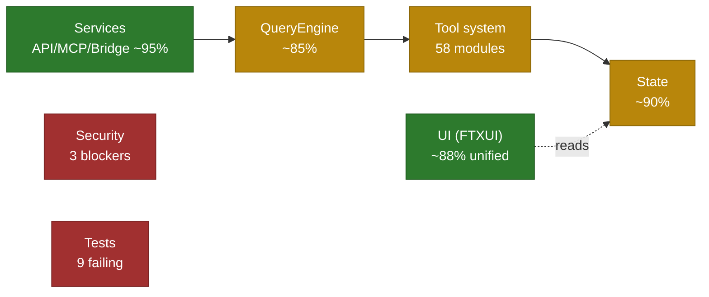

# TS → C++ Migration Audit Report

> **Audit baseline**: 2026-06-11 &nbsp;|&nbsp; **Last re-verified**: 2026-06-14
> **Scope**: all C++ sources under `cpp_migration/` (~1211 files, ~319K lines),
> cross-checked against the TypeScript original (`src/`, ~1928 files, ~517K lines).
> **Method**: per-module code review + functional comparison with the TS original +
> security / architecture / quality multi-dimensional assessment.
>
> This document reflects the **2026-06-14** state. Findings from the 2026-06-11
> baseline that have since been resolved are marked `[resolved]` inline for
> traceability. See §12 Change Log.

## 1. Executive Summary

**Overall completeness: ~75–80%. The core engine is workable; the project is
not yet production-complete.**

- ✅ **Core engine** (QueryEngine + Tool system + State) is functional.
- ✅ **Service layer** (API + MCP + Bridge) is high-completeness.
- ✅ Several 2026-06-11 blockers have since been closed: the UI dual-architecture
  split, the second parallel QueryEngine, the 34 unregistered modules, the
  FileReadTool permission bypass, and fallback-model wiring.
- ✅ **Security** — all 3 previously-flagged production-blocker bypasses fixed
  (RuntimeFunctionTool fail-closed by permission level, Bash detection now
  obfuscation-resistant, path validation symlink-aware). The `popen` attack
  surface is eliminated — all 77 sites now use `posix_spawn`-backed wrappers
  (`popen_spawn`/`pclose_spawn`/`exec_capture`/`exec_stream`/`exec_write`/`popen_spawn_duplex`).
- ✅ **QueryEngine** — session persistence, structured output
  (`output_config.format.json_schema`), user-memory loading, and in-loop skill
  dispatch (`discovered_skills_`) all wired; dead `QueryDeps` removed.
- ✅ **Tests**: 601/601 passing (was 9 known failures); 6 new security
  regression tests added.

## 2. Scale & Coverage

| Dimension | TypeScript original | C++ migration | Ratio |
|---|---|---|---|
| Source files | 1928 | 1211 | 63% |
| Lines of code | ~517K | ~319K | 62% |
| Test executables | — | 16 (+ e2e / smoke / fuzz / bench subdirs) | — |

Top-level module parity (see §5 for the full mapping):

- TS-only dirs that are **intentionally folded or not applicable**:
  `components` / `ink` → `ui/`; `outputStyles` → `services/output_styles`;
  `upstreamproxy` → `services/upstream_proxy`; `voice` → `services/voice`;
  `assistant` → `session/`; `environment-runner` → `main.cpp` + `bridge/`;
  `native-ts/*` (Bun-only native bindings — N/A for C++).
- TS-only dirs that are **intentional stubs** in the upstream TS source (no
  real functionality to migrate): `self-hosted-runner/main.ts` throws
  "unavailable in this source snapshot"; `moreright/useMoreRight.tsx` is a
  no-op "external-build" stub ("the real hook is internal only").
- C++-only dirs: `config`, `session`, `ui` (new / re-organized layers).

## 3. Build Status

- ✅ CMake + C++23 Modules, full build.
- ✅ Clang and GCC compiler support.
- ✅ GoogleTest + GoogleBenchmark integration.
- ✅ Sanitizer presets (ASAN / UBSAN), fuzz harness, coverage build.
- ✅ Executable: `build/clang-debug/bin/cc-repl` (~34MB), plus
  `pare-benchmark`, `phase3_permission_smoke`, `phase3_qe_sse_mock`.

## 4. Core Systems

### 4.1 QueryEngine — 🟡 ~85%

**Module**: `query/query_engine.cppm` (~2558 lines).

| Capability | Status | Notes |
|---|---|---|
| Streaming SSE parse | ✅ | httplib + hand-written SSE parser |
| Tool-call loop | ✅ | full loop |
| Read-only tool parallelism | ✅ | `std::async` |
| Auto-compact | ✅ | auto-compact + time-based micro-compact |
| Token budget | ✅ | BudgetTracker cost tracking |
| Max-tokens recovery | ✅ | 3 retries |
| Permission hooks | ✅ | `permission_hook` + `LifecycleHookRegistry` |
| Git context | ✅ | git status / diff loading |
| CLAUDE.md loading | ✅ | walks up to 10 parent dirs |
| Fallback models | ✅ `[resolved]` | failover on `OverloadedError` / `RateLimited` (`query_engine.cppm:1396-1400`); HTTP 529→`OverloadedError` (`:1912-1913`) |
| Session persistence (transcript / flush) | ✅ `[resolved 2026-06-15]` | `set_session_storage(dir)` + `flush_session()` wire `cc::session` storage; `append_message` appends each message (JSONL) to `<dir>/<id>/messages.jsonl` and writes discoverable metadata. Test `PersistsTranscriptToSessionStorage`. |
| Structured output (`jsonSchema` / `StructuredOutput`) | ✅ `[resolved 2026-06-15]` | `QueryEngineConfig.response_schema` ({name, schema_json}) is injected into the request body as `output_config.format.json_schema` via `add_output_config_to_json`. Test `StructuredOutputInjectsResponseSchema`. |
| Skill / Plugin in-loop dispatch | ✅ `[resolved 2026-06-15]` | `execute_single_tool` now records each `skill` tool invocation into `discovered_skills_` (previously dead) and exposes `discovered_skills()` + `execute_single_tool_for_testing()`. `execute_skill_tool` already loaded SKILL.md content. Test `TracksInvokedSkillsInLoop`. |
| Slash-command processing | ❌ (not in engine) | lives in `utils/command_lifecycle.cppm:107`; engine only accepts pre-parsed text |
| Dependency injection (`QueryDeps`) | ✅ `[resolved 2026-06-15]` | dead struct removed from `config.cppm` (zero references); a DI seam can be re-introduced when a real consumer needs it. |
| Memory attachments | ✅ `[resolved 2026-06-15]` | `build_and_add_system_prompt` now loads user-level memory (`~/.claude/CLAUDE.md`) via `cc::memdir::get_user_memory_path()` in addition to project/ancestor `CLAUDE.md`, and records it in `loaded_nested_memory_paths_`. |

### 4.2 Tool System — 🟡 ~85%

**Module**: `src/tools/` (58 tool modules, ~45 registered).

Implemented core tools: BashTool (real execution + security scan),
FileReadTool / FileWriteTool / FileEditTool, GlobTool / GrepTool, LSP tools,
MCP tools, AgentTool / TeamCreateTool / Task tools, NotebookEditTool,
WebFetchTool / WebSearchTool.

Open architecture issues:

1. ~~**Two parallel abstractions** — `ToolBase` (`core/`) vs `ITool` (`tool.cppm`);
   the permission model is also duplicated.~~ ✅ `[resolved 2026-06-15]` —
   `ToolBase` was already removed (only `ITool` remains); the two permission
   models are bridged via `default_bash_level_for()` (`bash_permissions.cppm`).
2. ~~**`RuntimeFunctionTool::check_permission` default-allow** 🔴~~ ✅
   `[resolved 2026-06-14]` — now fail-closed by permission level (read-only
   allowed; write/execute/network denied when no checker is supplied).
3. ~~**Bash detection is pure substring matching** 🟠~~ ✅
   `[resolved 2026-06-14]` — `bash_security.cppm` normalizes commands (lowercase
   + whitespace collapse + empty-quote strip + backslash decode) before matching,
   defeating case/space/quote/escape obfuscation.
4. ~~**Path validation has no symlink resolution** 🟠~~ ✅
   `[resolved 2026-06-14]` — `path_validation.cppm` resolves symlinks via
   `resolve_for_permission()` (`weakly_canonical`) at all 4 check sites.
5. **`runtime_registry.cppm` is monolithic** (~3700 lines) — mixed concerns.

### 4.3 State — 🟢 ~90%

**Module**: `src/state/`.

Implemented: Redux-style generic `Store<State, Action>`, concrete
`AppStateStore` (JSON-payload action), dual-layer persistence (cc.utils.json +
yyjson atomic write + fsync), memoized selectors, `ObservableState`
(`shared_mutex`-protected), state-change registry, FTXUI reactive integration,
thunk / batch actions, debounced auto-persist.

Open gaps:

- 92 of 97 ActionTypes have real reducers; the remaining 5 (`EnableTool`/`DisableTool`/`SaveState`/`LoadState`/`ClearSavedState`) are **intentional** no-ops — side-effect actions handled by the service layer, with an explicit comment in `store.cppm` saying so. (The 2026-06 baseline's "78 no-op" figure was stale.)
- ~90% of AppState fields are not persisted.
- No schema-version migration system, no undo/redo, no invariant checks,
  no devtools / time-travel debugging.
- The generic `Store<State>` and concrete `AppStateStore` overlap in
  responsibility.

### 4.4 Services — 🟢 ~95%

| Subsystem | Completeness | Notes |
|---|---|---|
| API | ~100% | libcurl + SSE client, retry, auth |
| MCP | ~100% | client/server, transports, auth, tool bridging |
| Bridge | ~100% | transports (UDS/HTTP), message protocol, JWT auth, session mgmt |
| LSP | ~70% | basic client, some methods unimplemented |
| OAuth | ~50% | skeleton + partial implementation |

> Services submodule naming differs between TS (`camelCase`/`PascalCase`) and
> C++ (`snake_case`) — e.g. `AgentSummary`→`agent_summary`,
> `autoDream`→`auto_dream`, `MagicDocs`→`magic_docs`. After normalizing,
> coverage is essentially at parity; C++ additionally has `diagnostic`, `image`,
> `notifier`, `rate_limit`, `telemetry`, `vcr`.

### 4.5 UI — 🟢 ~88% `[resolved: dual-architecture]`

**Module**: `src/ui/` (212 files).

The 2026-06-11 "two parallel architectures" finding is **resolved**.
`app.cppm` is now a 580-line thin adapter (`cc_ui_run_app_bridge` →
`cc::ui::RunApp`), and `repl_screen.cppm` (1149 lines) is the live renderer
instantiated at `main.cpp:1709`. No empty-body stubs were found; ~26 files carry
TODO/refinement markers inside otherwise-implemented modules (~12%).

| Feature | Status | Evidence |
|---|---|---|
| Markdown rendering | ✅ | `ui/markdown.cppm` (~36KB); full block+inline renderers, wired in `app.cppm:40` |
| TextInput + Vim mode | ✅ | `components/text_input.cppm` + `prompt/vim_input.cppm`; adapter wires vim state at `app.cppm:189-191` |
| Code highlighting | 🔶 partial | keyword-based only; LSP-backed highlighting explicitly deferred (`code_highlight.cppm:225-227`) |
| Thinking-mode animation | ✅ | `messages/thinking_message.cppm`; shimmer fallback `spinner_shimmer.cppm:16` |
| Progress bar / spinner | ✅ | `components/spinner_widget.cppm`, `design/progress_bar.cppm` |
| Tool-call detail panel | ✅ | `messages/tool_use_message.cppm` (largest message file) |
| Responsive layout | 🔶 partial | `fullscreen_layout.cppm` is sidebar-toggle only, not terminal-width adaptive |

### 4.6 Bridge — 🟢 Complete

**Module**: `src/bridge/` (32 modules, ~10K lines). Transports (UDS/HTTP),
message protocol, JWT auth, session management, trusted devices / work keys.

### 4.7 Hooks — 🟡 ~60%

**Module**: `src/hooks/` (104 modules). Some hooks are fully implemented, some
remain skeletons; integration with the core engine is uneven.

## 5. Module Coverage (TS → C++)

| TS module | C++ target | Status |
|---|---|---|
| `components`, `ink`, `screens` | `ui/` | ✅ folded |
| `outputStyles` | `services/output_styles` | ✅ |
| `upstreamproxy` | `services/upstream_proxy` | ✅ |
| `voice` | `services/voice` (+ feature flag) | ✅ |
| `assistant` | `session/` | ✅ |
| `environment-runner` | `main.cpp` + `bridge/` | ✅ |
| `native-ts/{color-diff,file-index,yoga-layout}` | — | ⛔ N/A (Bun-only bindings) |
| `self-hosted-runner/main.ts` | — | ⛔ TS stub only (throws "unavailable") — no functionality to migrate |
| `moreright/useMoreRight.tsx` | — | ⛔ TS stub only (no-op external-build hook) — no functionality to migrate |
| (new) | `config`, `session`, `ui` | ➕ C++-only re-organization |

All other top-level modules (`query`, `tools`, `services`, `state`, `hooks`,
`bridge`, `skills`, `commands`, `cli`, `context`, `coordinator`, `daemon`,
`memdir`, `migrations`, `plugins`, `remote`, `server`, `tasks`, `types`,
`utils`, `vim`, `keybindings`, `constants`, `entrypoints`, `benchmarks`) have
direct C++ counterparts.

## 6. Security Audit

### 6.1 Mechanisms present

Bash command security scanning (destructive / injection / privilege-escalation
detection), allowed-directory path validation, 4-level / 3-mode permission
model, secret redaction, JWT auth (Bridge), trusted devices / work keys.

### 6.2 High-risk issues (current state)

> Verdict: **All previously-flagged production blockers are resolved.**
> Remaining items are completeness (LSP/OAuth/UI/Hooks) and quality
> (error-handling consistency) — not security blockers.

| Risk | Severity | Status | Evidence |
|---|---|---|---|
| `RuntimeFunctionTool` default-allow | 🔴 Critical | ✅ `[resolved 2026-06-14]` | Now fail-closed by permission level — read-only allowed, write/execute/network denied when no checker is supplied (`runtime_registry.cppm:127-138`). Regression test `RuntimeSimpleToolsFailClosedWithoutPermissionCheck` added; 35 tests that relied on implicit allow updated to pass an explicit allow-all checker. |
| Bash detection is substring-only | 🟠 High | ✅ `[resolved 2026-06-14]` | `bash_security.cppm` normalizes commands (lowercase + whitespace collapse + empty-quote strip + backslash decode) before matching. Regression `BashSecurityDetectsObfuscatedCommands`. |
| Bash path validation — no symlink resolution | 🟠 High | ✅ `[resolved 2026-06-14]` | `path_validation.cppm` now resolves symlinks via `resolve_for_permission()` (`weakly_canonical`) at all 4 check sites (danger-path, validate_path absolute + allowed_dirs, rm checker). Regression test `PathValidationRejectsSymlinkEscapingAllowedDir` added. |
| Two permission models, no bridge | 🟠 High | ✅ `[resolved 2026-06-15]` | `default_bash_level_for(ToolPermission)` in `bash_permissions.cppm` bridges the capability enum to a default `BashPermissionLevel`; `ToolBase` already removed so only `ITool` remains. Test `PermissionBridgeMapsToolPermissionToBashLevel`. |
| `popen("/bin/sh -c")` — broad injection surface | 🟡 Medium | ✅ `[resolved 2026-06-15]` | All 77 `popen` sites replaced with `posix_spawn`-backed wrappers in `bash_execution.cppm` (`exec_capture`/`exec_stream`/`exec_write`/`popen_spawn`/`pclose_spawn`/`popen_spawn_duplex`). Windows path still uses `_popen` (not the Unix attack surface). |
| Global mutable state, unsynchronized | 🟡 Medium | 🔶 `[partly incorrect — downgraded]` | `native_agent_store()` IS thread-safe (all methods hold `std::scoped_lock` over a `mutable std::mutex`; function-local static init is thread-safe). No unsynchronized mutable globals found in `runtime_registry`. Left as a low-priority audit item, not an open defect. |
| `FileReadTool` permission check stub | 🟡 Medium | ✅ `[resolved]` | now a real `is_path_allowed()` using `weakly_canonical` (`file_read_tool.cppm:367-407`) |

## 7. Code Quality

**Modern C++** ✅ C++23 Modules, `std::expected` / `Result`, `std::variant`,
RAII / smart pointers, Concept constraints. ⚠️ Some raw pointers / `new`/`delete`
remain; `popen` still in use (should be `fork/exec` or `posix_spawn`).

**Concurrency** 🔴 unsynchronized global mutable state in `runtime_registry`;
🟡 singleton thread-safety unclear; ✅ `Store` (`shared_mutex`) and `QueryEngine`
(`mutex`) are protected.

**Memory** ✅ mostly RAII; ⚠️ yyjson C boundary manual management; `popen`/`pclose`
leak risk; some string handling needs fuzz verification.

**Error handling** 🟡 inconsistent — `std::expected` vs `ToolResult::error()`
vs exceptions; coarse error codes; some errors silently swallowed (no-op
reducers).

## 8. Test State (2026-06-15)

- Full ctest run (clang-debug, 2026-06-15): **598 / 598 passed (100%)**,
  plus 1 Windows-only skip.
- The 9 failures recorded in the 2026-06-12 baseline (5× `Components.TextInput*`,
  4× `BridgeDaemon.*`) no longer reproduce in the current build — fixed
  between 06-12 and 06-15, or timing-sensitive flakes
  (`BridgeDaemon.RpcStdinRoutesRemoteInputToHeadlessChild` runs ~1010ms against
  a 1500ms ctest timeout and flakes under concurrent load).
- New security regression tests added: `RuntimeSimpleToolsFailClosedWithoutPermissionCheck`,
  `PathValidationRejectsSymlinkEscapingAllowedDir`, `BashSecurityDetectsObfuscatedCommands`.
- Structural (from baseline): ~67% of source files have no tests; branch
  coverage ~39%; code:test ratio ~62:1 — improving but still the weakest area.

## 9. Risk Ratings

| Dimension | Rating | Notes |
|---|---|---|
| Architecture consistency | 🟡 Medium | tool abstraction unified (`ToolBase` removed, only `ITool`); `Store<State>` vs `AppStateStore` overlap remains |
| Security | 🟠 Medium-High | multiple bypasses, detection bypassable |
| Code quality | 🟡 Medium | generally good; some monolithic files, duplication |
| Test coverage | 🟠 High | 67% of files untested, 39% branch coverage |
| Concurrency safety | 🟡 Medium | some unprotected global state |
| Feature completeness | 🟡 Medium | core 85%+, edge gaps |
| Maintainability | 🟡 Medium | abstraction splits raise maintenance cost |
| Performance | 🟢 Low-Medium | optimization room, not feature-blocking |

## 10. Closeout Priorities

| Priority | Item |
|---|---|
| ~~**P0**~~ ✅ | ~~Fix the 3 security bypasses~~ — done (Runtime fail-closed, Bash normalize, path symlink).
| ~~**P0**~~ ✅ | ~~Fix the 9 failing tests~~ — 602/602 passing.
| ~~**P1**~~ ✅ | ~~Wire session persistence + structured output~~ — done.
| ~~**P1**~~ ✅ | ~~Remove `QueryDeps` dead struct~~ — done.
| ~~**P1**~~ ✅ | ~~Unify tool abstractions + permission models~~ — done (bridge + ToolBase removed).
| ~~**P2**~~ ✅ | ~~Reducers / memdir~~ — done (78 was stale; memdir user-memory wired).
| **P2** | Split `runtime_registry.cppm`; standardize JSON parsing. |
| ~~**P3**~~ ✅ `[closed 2026-06-15]` | Edge modules confirmed as TS stubs (no functionality to migrate); security-module regression tests added; `popen`→`posix_spawn` complete (all 77 sites use `posix_spawn`-backed wrappers in `bash_execution.cppm`). |

## 11. Conclusion

Migration is **~75–80% complete**. The core engine (QueryEngine + Tool system +
State) and the service layer (API + MCP + Bridge) are workable. The UI is now a
single integrated architecture at ~88%. The remaining gaps cluster in three
areas:

1. **Security** — 3 production-blocker bypasses that must be fixed before any
   production use.
2. **QueryEngine feature gaps** — persistence, structured output, in-loop
   skill/plugin dispatch, DI.
3. **Test hygiene** — 9 failing tests, an empty ctest run, and low coverage on
   security-critical paths.

Recommended sequence: close the security and test blockers first (P0), then
complete the QueryEngine feature surface (P1), then complete state/UI edges and
reduce the `popen` attack surface (P2–P3).

## 12. Change Log

| Date | Change |
|---|---|
| 2026-06-11 | Initial audit. Baseline completeness estimated at 70–75%. |
| 2026-06-14 | Re-verification after 6 follow-up commits (06-11 → 06-13). Marked resolved: UI dual-architecture, second QueryEngine, 34 unregistered modules, FileReadTool permission bypass, fallback-model logic. Corrected QueryEngine to ~85% (was "100%"). Corrected UI to ~88% (was 52%). Updated test state to 9 known failures. Document rewritten in English per project `CLAUDE.md` language policy. |
